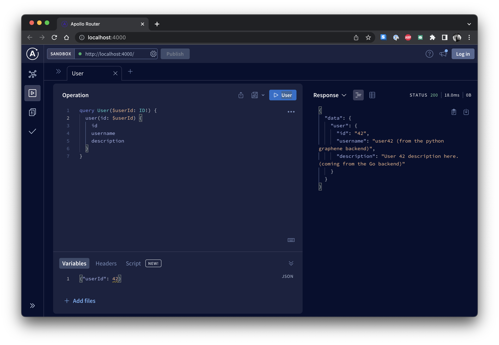

# Hackathon Starter Project

Welcome to the Hackathon Starter Project! This project is designed to give you a comprehensive set of templates to kickstart your coding journey, whether you're participating in a hackathon or just exploring on your own. It features a variety of backends and a frontend template, plus a gateway and Docker compose examples to tie everything together.


## GraphQL Federated Gateway


Showing the result of

```graphql
query User($userId: ID!) {
  user(id: $userId) {
    id
    username
    description
  }
}
```

With arguments of
```json
{"userId": 42}
```

Returning
```json
{
  "data": {
    "user": {
      "id": "42",
      "username": "user42 (from the python graphene backend)",
      "description": "User 42 description here. (coming from the Go backend)"
    }
  }
}
```

## Directory Structure

The project is divided into various directories, each corresponding to a distinct part of the application. Here's a quick breakdown:

- [`./fastapi-backend`](./fastapi-backend): This is a backend service built using FastAPI, a high-performance Python framework for building APIs.

- [`./graphene-backend`](./graphene-backend): This is another backend service built with Flask and Graphene. Flask is a lightweight web application framework for Python, while Graphene is a Python library for building GraphQL APIs in Python.

- [`./go-graphql-backend`](./go-graphql-backend): This directory contains a backend service implemented in Go with the help of gqlgen, a Go library for building GraphQL servers. It includes support for subscriptions.

- [`./react-frontend`](./react-frontend): This is a frontend application built with React and TypeScript. React is a JavaScript library for building user interfaces, and TypeScript is a statically typed superset of JavaScript that adds optional types.

- [`./gateway`](./gateway): This directory contains a sample setup that combines multiple backend services. 

- [`./dev-harness`](./dev-harness): This directory contains examples of `docker-compose.yml` files showing how to configure Docker Compose to run the various components of this project together.

Each directory contains a `README.md` file with more detailed information about that part of the project. 

## Getting Started

### Pre-requisites

This codebase requires the following tools to be present on your machine.

- [Docker](https://docs.docker.com/get-docker/)
- [Homebrew](https://brew.sh/)

The sample service set will attempt to bind these local network ports:
- [3000](http://localhost:3000) - React Frontend.
- [4000](http://localhost:4000) - GraphQL Gateway.
- [5432](https://www.postgresql.org/docs/current/app-psql.html) - PostgreSQL database.
- [8000](http://localhost:8000/graphql) - Python Graphene backend.
- [8080](http://localhost:8080) - Go GraphQL backend
- [6379](https://redis.io/docs/ui/cli/#command-line-usage) - Redis Server.
- [6380](http://localhost:6380) - RedisInsight web UI.
- [16686](http://localhost:16686) - [Jaeger](https://www.jaegertracing.io/docs/1.45/getting-started/) web UI (Distributed Trace
  Viewer).
- [14268](http://localhost:14268) - [Jaeger](https://www.jaegertracing.io/docs/1.45/getting-started/) collector port.


**note**: Run `make port-doctor` to see if these ports are already bound by another process.

**note**: Run `make port-doctor-kevorkian` to try to kill processes listening to these ports.

### Running the Project

To get started with this project, first make sure you have Docker installed.

Then, choose which backend you'd like to start with (`fastapi-backend`, `graphene-backend`, or `go-graphql-backend`) and follow the instructions in the corresponding `README.md` file to build and run the backend.

Next, follow the instructions in the [`react-frontend/README.md`](./react-frontend/README.md) to start the frontend application.

Finally, you can explore the `gateway` and `dev-harness` directories to see examples of how to combine the different parts of the project.

To launch a pre-prepared set of services you can run:

```shell
make sample-service-set
```

## Further Reading

- [FastAPI Documentation](https://fastapi.tiangolo.com/)
- [Flask Documentation](https://flask.palletsprojects.com/)
- [Graphene Documentation](https://docs.graphene-python.org/)
- [Gqlgen Documentation](https://gqlgen.com/)
- [React Documentation](https://reactjs.org/)
- [Docker Compose Documentation](https://docs.docker.com/compose/)

We hope this gives you a good introduction to the Hackathon Starter Project. Happy coding!
